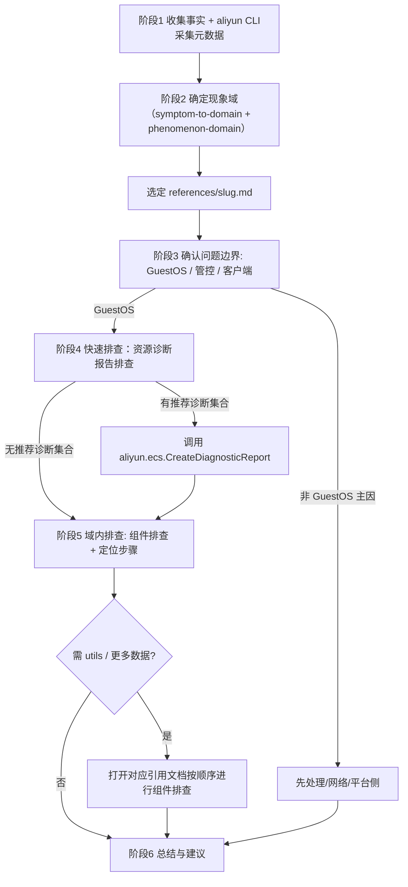

# ECS Linux 问题排查

本技能**仅适用于阿里云 ECS 上的 Linux GuestOS**，针对用户指定的阿里云 ECS Linux 实例（目标机）进行异常问题排查。Agent 运行在目标机或他机上，通过 aliyun CLI 工具对目标 ECS 实例进行远程诊断与数据采集。

## 何时使用本技能

- 用户指定的排查对象为阿里云 ECS Linux 实例时。
- 用户描述涉及启动/运行状态与 OS 不符、远程登录失败、网络不通、磁盘/扩容/挂载、性能异常、宕机夯机、时钟、配置不生效等异常问题时。
- **不适用**：非阿里云 ECS、非 Linux GuestOS、其它云或物理机；纯管控/计费/API 侧问题且无 GuestOS 参与

## 原则与要求

1. **排查对象 = 用户指定的阿里云 ECS Linux 实例**：所有检查、结论都针对这一台机器。`references/` 中的命令、路径等按实例内环境编写。
2. **使用 aliyun CLI 工具进行远程诊断和数据采集。**：要求除 [`references/utils/guestos-pe-prep.md`](references/utils/guestos-pe-prep.md) 中步骤外其他步骤只能使用[`references/aliyun-cli-cheatsheet.md`](references/aliyun-cli-cheatsheet.md)中列出的子命令，**不得调用未列出的子命令**。
3. **先搞清问题再查**：严格遵循**排查流程**，需要先把用户描述收敛为**现象域**，再按**排查文档**执行排查。
4. 优先按照`references/<slug>.md` 排查文档中描述运行排查所需命令，**不要盲目自行猜测命令**。
5. **多实例场景**：每台 ECS 须分别执行排查，不要混用 A 机的结果去结论 B 机。

## 排查流程

**必须按序执行**

### 阶段 1：异常问题澄清

在打开任何域文档前，如果用户问题描述较模糊时**先通过多轮对话细化问题**，并通过 **aliyun CLI** 和 **向用户询问** 尽量补齐异常问题发生的证据和相关的环境信息，通常会涉及以下信息：

| 维度 | 要补齐的内容 | 获取方式 |
| --- | --- | --- |
| **实例基本信息、状态、规格** | 实例状态 | 按需调用 aliyun CLI |
| **范围** | 是否必现；起止时间；异常问题发生时是否存在变更、重启、扩缩容 | 向用户询问 |
| **通道** | VNC 是否可用；SSH/Workbench/云助手是否可用 | 向用户询问 |
| **网络方向** | 外部→实例业务端口、实例→外部网络、仅 VPC 内互通等 | 向用户询问 |
| **表现** | 报错原文、截图 | 向用户询问 |

### 阶段 2：归类到现象域

1. 打开 [`references/symptom-to-domain.md`](references/symptom-to-domain.md)，按用户澄清后的异常问题描述选现象域大类和现象域。
2. 输出：**一个现象域**，并记下现象域对应的排查文档路径 `references/<slug>.md`。同时**要求用户确认现象域是否准确**，准确后才进入「阶段 3」。如用户告知不准确，将将排除第 2 步中现象域后 TOP 3 的次现象域展示给用户，让用户确认是否属于这些次现象域。如用户告知不属于任何一个次现象域，则终止后续所有流程，并建议用户提交阿里云工单。

### 阶段 3：确认是否属于 GuestOS 问题

打开选定的 `references/<slug>.md` 后，按顺序完成文档开头的「确定是否属于 GuestOS 问题」章节中的步骤，要求:

1. **必须**确认属于 GuestOS 问题后，再进入后续所有步骤，否则直接返回异常问题结论给用户。
2. **优先自行按顺序完成判定**：凡是能通过 aliyun CLI 获取的数据，直接调用获取，**不得在没有尝试通过 aliyun CLI 获取数据的情况下直接询问用户**。仅当信息确实只能从控制台或用户侧客户端环境获取时，才向用户询问。
3. **没完成判定前，不要进入后续所有步骤。**

### 阶段 4：诊断工具排查

在进入域内细节排查之前，先根据现象域推荐的诊断工具进行快速排查。

1. 查看 [`references/phenomenon-domain.md`](references/phenomenon-domain.md) 中当前现象域对应的「推荐的诊断集合」列，确定需要调用的诊断集合列表。若推荐列为「—」（无推荐的诊断集合），则跳过本阶段，直接进入「阶段 5」。
2. **首先，向用户确认是否执行推荐的诊断集合**。**如果用户同意**，则根据第 1 步获取的诊断集合列表**按顺序**参考 [`references/create-diagnostic-report.md`](references/create-diagnostic-report.md) 中的步骤创建资源诊断报告执行诊断。**如果用户不同意**，则略过此阶段。注意：
  1. 如果诊断集要求额外入参，优先通过 aliyun CLI 工具查询相关数据，只在无法通过 aliyun CLI 获取数据时，才要求用户提供。
  2. 如果诊断集合不存在或创建资源诊断报告失败，则先向用户说明情况，然后略过此阶段，直接进入下一阶段。
4. 查看资源诊断报告详情，如果诊断报告中已经有与异常问题强相关的诊断项，直接进入「阶段 6」。否则，诊断报告输出结果应带入后续阶段，结合域内流程一起分析。

### 阶段 5：GuestOS 内问题相关组件排查

阅读 `references/<slug>.md` 的 **GuestOS 内** 部分：
1. 阅读其中的 **相关组件** 列表，这是当前现象域可能涉及的 GuestOS 组件，如网卡、路由、DNS、防火墙、sshd、PAM、磁盘、内核等。
2. 按文档给出的 **问题定位** 步骤进行排查，排查步骤中指向组件排查文档链接`references/utils/<component-slug>.md`时，打开对应引用文档按顺序进行组件排查。要求**通过 aliyun CLI 工具采集数据**（需要采集当前现象域的 GuestOS 内数据时可调用 `aliyun.ecs.RunCommand`）。并且命令要尽可能详细，要尽量**一次性收集本现象域所有所需数据**，以减少 RunCommand 执行次数。
3. **不进行任何修复操作**，只给出结论与修复建议。

### 阶段 6: 总结与建议

最后，根据以下两种情况给出总结与建议：

- **已定位根因**：给出结构化的诊断报告，说明现象域、排查过程的证据链、结论，并给出修复或规避该问题的建议。要求：
  1. **必须**按模板[`references/diagnosis-report-template.md`](references/diagnosis-report-template.md)生成诊断报告。
  2. 清晰可读，避免空泛。
  3. 当存在多个根因时，需要分析他们的关系：是否由一个根因导致另一个根因，或者多个根因共同导致问题。
- **根因仍不确定**：列出已排除的候选根因，并给出下一步排查建议。

## 流程总览

## 引用文档索引

| 路径 | 用途 |
| --- | --- |
| [`symptom-to-domain.md`](references/symptom-to-domain.md) | 自然语言 → 现象域路由 |
| [`phenomenon-domain.md`](references/phenomenon-domain.md) | 权威表：唯一标识、概念、典型现象、slug、推荐的诊断工具 |
| [`aliyun-cli-cheatsheet.md`](references/aliyun-cli-cheatsheet.md) | aliyun CLI 工具速查（白名单子命令） |
| [`create-diagnostic-report.md`](references/create-diagnostic-report.md) | 资源诊断报告创建与解读 |
| [`references/<slug>.md`](references/) | 各现象域完整排查流程 |
| [`references/utils/<component-slug>.md`](references/utils/) | GuestOS 组件级排查 |
