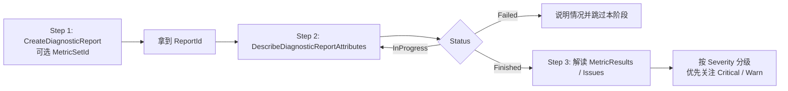

# 资源诊断（Diagnostic Report）使用指南

ECS 资源诊断是阿里云提供的官方诊断能力，按「诊断集合（MetricSet）」对实例做一次性体检，返回结构化的异常清单。用于在进入 GuestOS 内细查前快速识别管控/网络/GuestOS 层的常见问题。

## 调用流程



## Step 1：发起诊断

调用 `aliyun.ecs.CreateDiagnosticReport`，立即返回 `ReportId`。

```bash
aliyun ecs CreateDiagnosticReport \
  --RegionId <region-id> \
  --ResourceId <instance-id> \
  [--MetricSetId <metric-set-id>]
```

| 参数 | 说明 |
| --- | --- |
| `RegionId` | **必填**。实例所在地域，如 `cn-hangzhou`。 |
| `ResourceId` | **必填**。ECS 实例 ID，如 `i-bp1xxxxxxxxxxxx`。 |
| `MetricSetId` | 可选。诊断集合 ID。取值参考 [`phenomenon-domain.md`](phenomenon-domain.md)「推荐的诊断集合」列|
| `StartTime` / `EndTime` | 可选。当异常时间窗口明确时填写，UTC，ISO8601。 |
| `AdditionalOptions` | 可选。某些诊断集要求的额外入参（JSON 字符串），如目标 IP/端口。优先用 aliyun CLI 自查相关数据再填充，无法获取时再询问用户。 |

返回示例：

```json
{
  "ReportId": "dr-bp1xxxxxxxxxxxxxxxx",
  "RequestId": "..."
}
```

## Step 2：轮询报告状态

诊断通常在 **30 秒~2 分钟** 内完成。建议首次等待 ~20 秒后查询，仍为 `InProgress` 再隔 10~20 秒重试。**使用 `DescribeDiagnosticReportAttributes`** 查看诊断报告，它会返回所有指标项（`MetricResults`）的逐项结果与每个 Issue 的 `Additional` 上下文，便于做 Issue 级深读。

```bash
aliyun ecs DescribeDiagnosticReportAttributes \
  --RegionId <region-id> \
  --ReportId <report-id>
```

返回的 `Status` 字段：

| 取值 | 含义 | 后续动作 |
| --- | --- | --- |
| `InProgress` | 诊断中 | 继续轮询 |
| `Finished` | 诊断完成 | 解读 `MetricResults` 与 `Issues` |
| `Failed` | 诊断失败 | 向用户说明情况，跳过本阶段 |

## Step 3：解读诊断结果

`DescribeDiagnosticReportAttributes` 关键字段：

| 字段 | 含义 |
| --- | --- |
| `Severity` | 报告整体严重等级。`Critical` > `Warn` > `Info` > `Normal` > `Unknown`。 |
| `MetricSetId` | 实际生效的诊断集合 ID。 |
| `MetricResults.MetricResult[]` | 全部指标项逐项结果。每项含 `MetricId` / `MetricCategory` / `Severity` / `Status` 及该指标命中的 `Issues.Issue[]`。`Severity=Normal` 表示该指标无异常，可跳过；优先关注 `Critical` / `Warn` 项。 |
| `Issues.Issue[]` | 命中的具体 Issue。每项含 `IssueId`、`Severity`、`OccurrenceTime`、以及 `Additional`（JSON 字符串，承载关键上下文）。 |
| `StartTime` / `EndTime` | 诊断覆盖的时间窗口（UTC）。 |

**严重等级判断**：

- `Critical`：内核检测到的关键异常，通常与现象域强相关。
- `Warn`：高度疑似异常，需要结合现象域文档进一步验证。
- `Info`：相关上下文信息，可能与异常无关；不要单独据此下结论。
- `Normal` / `Unknown`：无异常 / 未开始或异常退出。